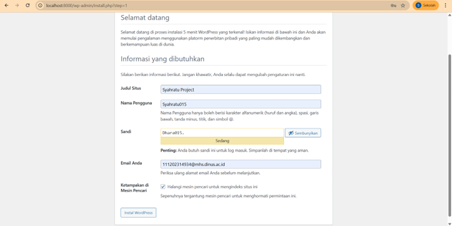
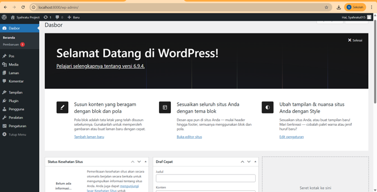
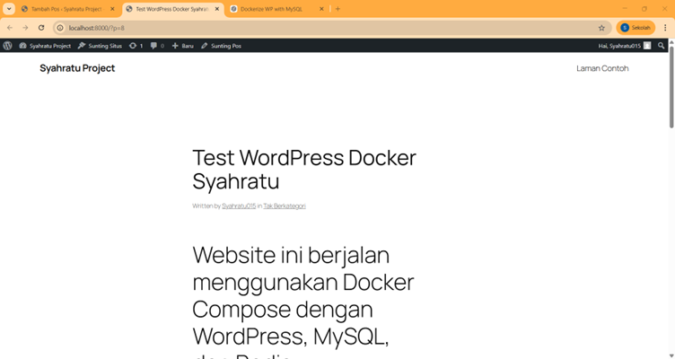
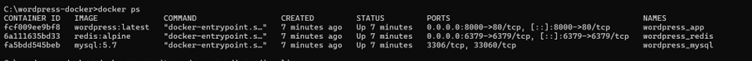
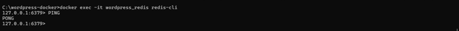
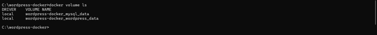

# Dockerized WordPress with MySQL and Redis

Project ini menjalankan WordPress menggunakan Docker Compose dengan MySQL sebagai database dan Redis sebagai object cache.

## Cara Menjalankan

1. Masuk ke folder project

2. Jalankan:

docker compose up -d

3. Buka browser:

http://localhost:8000

4. Install WordPress melalui halaman web.

## Cek Container

docker ps

Harus muncul:
- wordpress_app
- wordpress_mysql
- wordpress_redis

## Test Redis

Masuk ke container:

docker exec -it wordpress_redis redis-cli

Lalu jalankan:

ping

Jika berhasil akan muncul:

PONG

## Redis Object Cache Setup

Tambahkan konfigurasi di wp-config.php:

define('WP_REDIS_HOST', 'redis');
define('WP_REDIS_PORT', 6379);

Install plugin "Redis Object Cache" di WordPress dan aktifkan.

## Jawaban Pertanyaan

1. Kenapa perlu volume untuk MySQL?
Volume digunakan untuk menyimpan data database secara persistent sehingga data tidak hilang ketika container dihapus atau restart.

2. Apa fungsi depends_on?
depends_on memastikan container MySQL dan Redis dijalankan terlebih dahulu sebelum WordPress.

3. Bagaimana WordPress connect ke MySQL?
WordPress menggunakan environment variable WORDPRESS_DB_HOST=mysql:3306 sehingga container WordPress dapat terhubung ke MySQL melalui network Docker.

4. Apa keuntungan Redis untuk WordPress?
Redis digunakan sebagai object cache untuk mempercepat loading WordPress dengan menyimpan query database di memory.

## Screenshots

### WordPress Installation

### WordPress Dashboard

### Website View

### Docker Containers

### Redis Test

### Docker Volume
